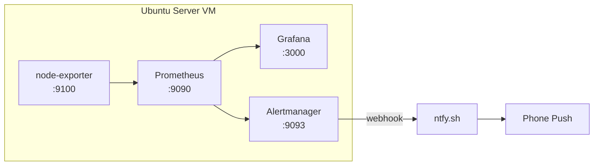

# DevOps Monitoring Lab

A self-hosted monitoring stack built on a homelab (Proxmox VE + Ubuntu Server + Docker), demonstrating a production-style observability pipeline: metrics collection, visualization and alerting.

## Architecture

## Tech Stack

表格

| Component | Role | Port |
| --- | --- | --- |
| node-exporter | Host metrics exporter | 9100 |
| Prometheus | Time-series DB + alert rules | 9090 |
| Grafana | Dashboards / visualization | 3000 |
| Alertmanager | Alert routing & notification | 9093 |
| ntfy.sh | Free push notifications | - |

## Features

- CPU / Memory / Disk / Network metrics with 15s scrape interval
- Pre-built dashboard (Grafana ID 1860, Node Exporter Full)
- Alert rules:
  - InstanceDown: target unreachable for 1 min (critical)
  - HighCPU: CPU usage > 80% for 1 min (warning)
  - DiskAlmostFull: disk usage > 90% for 5 min (critical)
- Push notifications to phone via ntfy
- Alert auto-resolution

## Quick Start

git clone [https://github.com/hencyzhang/devops-monitoring-lab.git](https://github.com/hencyzhang/devops-monitoring-lab.git)
cd devops-monitoring-lab
./scripts/setup.sh

Then open:

- Grafana: http://vm-ip:3000 (admin / admin)
- Prometheus: http://vm-ip:9090

## Alerting Setup

1. Install the ntfy app on your phone
2. Subscribe to a topic
3. Edit configs/alertmanager.yml webhook URL
4. Restart: docker compose restart alertmanager

## Hardware

- Host: Dell Latitude E7450 (16GB RAM)
- Hypervisor: Proxmox VE 8.x
- VM: Ubuntu Server 24.04 LTS (2 vCPU / 4GB RAM / 32GB disk)
- Networking: Tailscale for remote access

## Author

hencyzhang - DevOps / SRE career transition